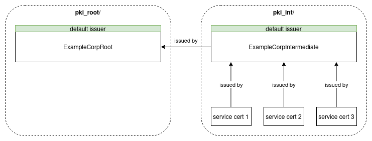

===================
hashi_vault backend
===================

Overview
~~~~~~~~

hashi_vault backend connects directly to the Vault instance (works with both
HashiCorp Vault and OpenBao).
There are several authentication mechanisms available
(token, userpass, jwt etc.).

With this backend certificates and keys are not stored on ansible controller.
Instead, they are installed directly on target hosts.

Prerequisites
~~~~~~~~~~~~~

- Fully configured Vault instance(either HashiCorp Vault or OpenBao)
- PKI engine enabled for all used paths (``pki_root/`` and ``pki_int/`` by
  default)
- Vault's role(``pki_hashi_vault_role``) defined in
  ``pki_hashi_vault_engine_mount_point``. This role defines the rules and
  constraints under which certificates can be issued.
  Example: ``bao write pki_int/roles/default allowed_domains=yourfqdn.com
  allow_subdomains=true ttl=90d``

Limitations
~~~~~~~~~~~
- hashi_vault backend issues certificates using a default issuer from
  ``engine_mount_point``. So there can be only one effective issuer in each
  ``engine_mount_point``
- ``community.hashi_vault.vault_pki_generate_certificate`` does not allow to
  pass ``key_usage`` or ``extended_key_usage`` parameter when generating a
  service certificate. These parameters need to be configured in Vault's role
  configuration. Default Vault's role configuration should work perfectly fine
  because it has both "TLS Web Server Authentication" and "TLS Web Client
  Authentication" in extended key usage).

PKI paths explained
~~~~~~~~~~~~~~~~~~~
Below diagram explains basic Vault architecture with two Vault paths.
There are several important things to notice:

- ``pki_root/`` path stores root certificate (it's a default issuer in that
  path)
- ``pki_int/`` path stores intermediate certificate (it's a default issuer in
  that path)
- services certs signed by intermediate certificate are also stored in
  ``pki_int/`` path
- intermediate certificate is signed by the default issuer from the path
  specified in ``signed_by`` (root certificate is not directly specified, only
  the path where it resides)
- when issuing service cert, ``engine_mount_point`` parameter points to the
  path where certificate will be stored (default issuer from that path will
  sign the certificate)

Variables
~~~~~~~~~

pki_authorities
---------------

.. list-table::
   :header-rows: 1
   :widths: 20 1 79
   :align: left

   * - Variable
     - Required
     - Description
   * - add_basic_constraints
     - 𐄂
     - Whether to add a Basic Constraints extension with CA: true.
   * - alt_names
     - 𐄂
     - Specifies the requested Subject Alternative Names, in a comma-delimited list.
   * - backend
     - 𐄂
     - PKI backend that should be used for this certificate.
   * - cn
     - ✔
     - Common name of a certificate.
   * - country_name
     - 𐄂
     - Specifies the C (Country) values in the subject field of the resulting certificate.
   * - exclude_cn_from_sans
     - 𐄂
     - If true, the given common_name will not be included in DNS or Email Subject Alternate Names (as appropriate).
   * - format
     - 𐄂
     - Specifies the format for returned data.
   * - issuer_name
     - 𐄂
     - Provides a name to the specified issuer.
   * - key_bits
     - 𐄂
     - Specifies the number of bits to use for the generated keys.
   * - key_format
     - 𐄂
     - Specifies the private key format.
   * - key_name
     - 𐄂
     - When a new key is created with this request, optionally specifies the name for this.
   * - key_ref
     - 𐄂
     - Specifies the key (either default, by name, or by identifier) to use for generating this request.
   * - key_type
     - 𐄂
     - Specifies the desired key type; must be rsa, ed25519 or ec.
   * - key_usage
     - 𐄂
     - Specifies the allowed key usage constraint on issued certificates.
   * - locality_name
     - 𐄂
     - Specifies the L (Locality) values in the subject field of the resulting certificate.
   * - max_path_length
     - 𐄂
     - Specifies the maximum path length to encode in the generated certificate.
   * - name
     - ✔
     - Name of the certificate (used mainly to find the right authority when installing it on target hosts).
   * - not_after
     - 𐄂
     - Set the Not After field of the certificate with specified date value.
   * - organization_name
     - 𐄂
     - Specifies the O (Organization) values in the subject field of the resulting certificate.
   * - organization_unit_name
     - 𐄂
     - Specifies the OU (OrganizationalUnit) values in the subject field of the resulting certificate.
   * - permitted_dns_domains
     - 𐄂
     - A comma separated string (or, string array) containing DNS domains for which certificates are allowed to be issued or signed by this CA certificate.
   * - san
     - 𐄂
     - A dictionary containing dns, ip, uri and other SANs.
   * - serial_number
     - 𐄂
     - Specifies the requested Subject's named Serial Number value, if any.
   * - state_or_province_name
     - 𐄂
     - Specifies the ST (Province) values in the subject field of the resulting certificate.
   * - ttl
     - 𐄂
     - Specifies the requested Time To Live (after which the certificate will be expired).
   * - vault_path
     - ✔
     - Vault path where the certificate should be stored.
   * - signed_by
     - 𐄂
     - Vault path of the issuing certificate.

pki_install_ca
--------------

.. list-table::
   :header-rows: 1
   :widths: 20 1 79
   :align: left

   * - Variable
     - Required
     - Description
   * - filename
     - 𐄂
     - Name for the file containing the authority on the target hosts
   * - name
     - ✔
     - Name of the authority to install

pki_certificates
----------------

.. list-table::
   :header-rows: 1
   :widths: 20 1 79
   :align: left

   * - Variable
     - Required
     - Description
   * - backend
     - 𐄂
     - PKI backend that should be used for this certificate.
   * - cn
     - ✔
     - Common name of a certificate.
   * - engine_mount_point
     - 𐄂
     - Vault path where the certificate should be stored.
   * - exclude_cn_from_sans
     - 𐄂
     - If true, the given common_name will not be included in DNS or Email Subject Alternate Names (as appropriate).
   * - format
     - 𐄂
     - Specifies the format for returned data.
   * - key_format
     - 𐄂
     - Specifies the private key format.
   * - name
     - ✔
     - Name of the certificate (used mainly to find the right certificate when installing it on target hosts).
   * - role
     - 𐄂
     - Vault's role that should be used for generating certificate.
   * - san
     - 𐄂
     - A dictionary containing dns, ip, uri and other SANs.
   * - ttl
     - 𐄂
     - Specifies the requested Time To Live (after which the certificate will be expired).

pki_install_certificates
------------------------

.. list-table::
   :header-rows: 1
   :widths: 20 1 79
   :align: left

   * - Variable
     - Required
     - Description
   * - name
     - ✔
     - Name of the certificate that should be installed on a target host.
   * - dest
     - ✔
     - Path where certificate should be stored on a target host.
   * - group
     - 𐄂
     - Name of the group that should own the filesystem object, as would be fed to chown.
   * - mode
     - 𐄂
     - The permissions the resulting filesystem object should have.
   * - owner
     - 𐄂
     - Name of the user that should own the filesystem object, as would be fed to chown.
   * - type
     - ✔
     - Specifies the content that should be placed in a destination file. Accepted values: certificate, certificate_chain, ca_bundle, private_key.
